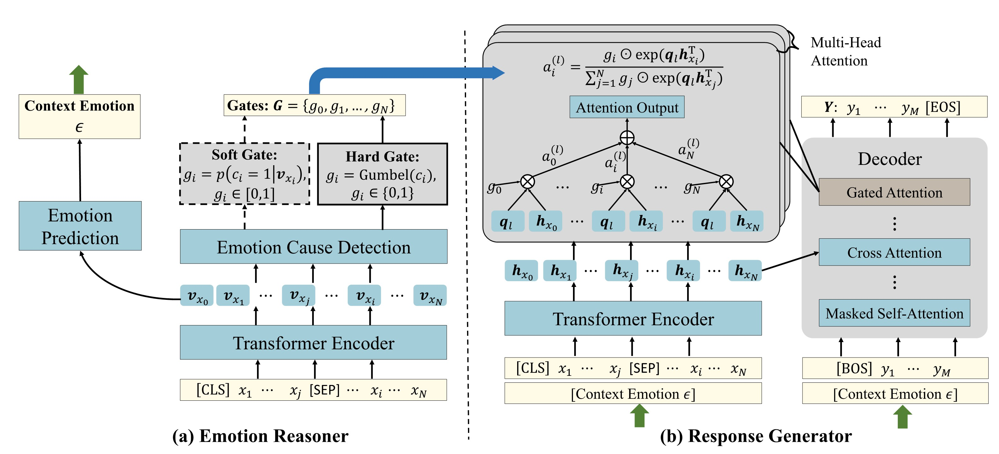

## Source code for our paper "Improving Empathetic Response Generation by Recognizing Emotion Cause in Conversations"

this repository is maintained by both [Jun Gao](https://github.com/gaojun4ever/) and [Yuhan Liu](https://github.com/A-Rain) 

### Environment Requirment
- pytorch >= 1.4.0
- texar.torch
- bert-score
- nltk

### Model Overview


### Running
1. we use [RECCON](https://github.com/declare-lab/RECCON) to train an emotion cause detection model and apply it to annatate [EmpatheticDialogues](https://github.com/facebookresearch/EmpatheticDialogues). The processed data is in `Data`.

2. Then you need to pretrain the emotion classification model, here you need to download [glove.6B.300d](https://nlp.stanford.edu/projects/glove/) first and then running the following command. Here `$GLOVE` is the glove embedding file:
    ```shell
    bash ./bash/run_emotion.sh --glove $GLOVE --gpu_id 0
    ```

3. To train the model and generate the automatic metric results, firstly you need to make sure that [bert-score](https://github.com/Tiiiger/bert_score) is successfully installed. In our paper, we use ***roberta-large-en*** rescaled with baseline to calculate BERTScore. You can download ***roberta-large-en*** from [Hugginface](https://github.com/huggingface/transformers). For the rescaled_baseline file, we can download it from [here](https://github.com/Tiiiger/bert_score/blob/master/bert_score/rescale_baseline/en/roberta-large.tsv). 

    Then run the following command. Here `$ROBERTA_DIR` is the downloaded ***roberta-large-en*** model directory and `$BASELINE` is downloaded baseline file.

    to train soft-gate model:
    ```shell
    bash ./bash/run_generation.sh --glove $GLOVE --gpu_id 0 --mode soft --roberta $ROERBTA_DIR --baseline $BASELINE --do_train
    ``` 

    to test soft-gate model:
    ```shell
    bash ./bash/run_generation.sh --glove $GLOVE --gpu_id 0 --mode soft --roberta $ROERBTA_DIR --baseline $BASELINE --do_test
    ``` 

    to train hard-gate model:
    ```shell
    bash ./bash/run_generation.sh --glove $GLOVE --gpu_id 0 --mode hard --roberta $ROERBTA_DIR --baseline $BASELINE --do_train
    ``` 

    to test hard-gate model:
    ```shell
    bash ./bash/run_generation.sh --glove $GLOVE --gpu_id 0 --mode hard --roberta $ROERBTA_DIR --baseline $BASELINE --do_test
    ``` 

    <!-- for example:
    ```shell
    bash bash/run_generation.sh --glove /home/liuyuhan/datasets/glove/glove.6B.300d.txt --gpu_id 2 --mode soft --roberta /home/liuyuhan/datasets/roberta-large-en/ --baseline /home/liuyuhan/datasets/roberta-large-en/roberta-large.tsv
    ``` -->

### Acknowledgement
```
@inproceedings{gao-etal-2021-improving-empathetic,
    title = "Improving Empathetic Response Generation by Recognizing Emotion Cause in Conversations",
    author = "Gao, Jun  and Liu, Yuhan  and Deng, Haolin  and Wang, Wei  and Cao, Yu  and Du, Jiachen  and Xu, Ruifeng",
    booktitle = "Findings of the Association for Computational Linguistics: EMNLP 2021",
    month = nov,
    year = "2021",
    pages = "807--819",
    publisher = "Association for Computational Linguistics"
}
```